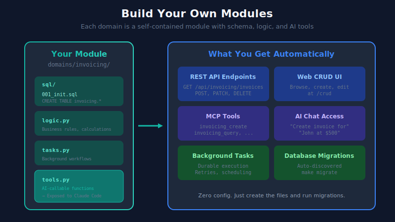
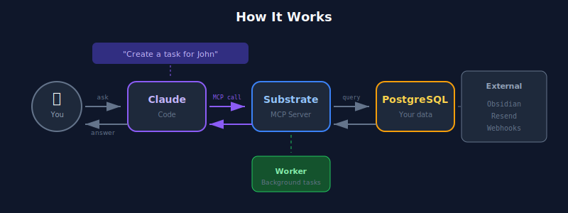

<p align="center">
  
</p>

<p align="center">
  <strong>The SaaS Killer.</strong><br>
  Replace your 10+ subscriptions with one AI-autonomous system you actually own.
</p>

<p align="center">
  <a href="https://opensource.org/licenses/MIT"></a>
  <a href="https://www.python.org/downloads/"></a>
  <a href="https://modelcontextprotocol.io/"></a>
</p>

---

## The Problem

You're paying $500+/month for fragmented SaaS tools. Your CRM doesn't talk to your task manager. Your calendar is isolated from your contacts. You can't query across systems. AI assistants can't help because they can't access your data. **You're renting software you'll never own.**

## The Solution

**Substrate** is your AI-native business operating system. One PostgreSQL database. One codebase. Complete ownership. AI agents that actually understand your entire business.

<p align="center">
  
</p>

---

## Modular By Design

Every feature in Substrate is a **self-contained module**. CRM, Tasks, Calendar—they're all just modules in the `domains/` folder. You can add your own in minutes.

<p align="center">
  
</p>

### Create a Module in 4 Steps

```bash
# 1. Create the folder
mkdir -p substrate/domains/invoicing/sql
```

```sql
-- 2. Define schema: sql/001_init.sql
CREATE SCHEMA IF NOT EXISTS invoicing;

CREATE TABLE invoicing.invoices (
    id UUID PRIMARY KEY DEFAULT gen_random_uuid(),
    contact_id UUID REFERENCES crm.contacts(id),
    status TEXT DEFAULT 'draft',
    total_cents INTEGER,
    due_at TIMESTAMPTZ,
    created_at TIMESTAMPTZ DEFAULT now()
);
```

```python
# 3. Add AI tools: tools.py
def create_invoice(contact_id: str, amount: int) -> dict:
    """Create an invoice for a contact."""
    # Your business logic here
    pass
```

```bash
# 4. Run migrations
make migrate
```

**That's it.** Your module now has:
- REST API endpoints (`/api/invoicing/invoices`)
- Web UI for browsing/editing
- MCP tools for Claude Code
- Background task support

---

## How It Works

<p align="center">
  
</p>

| Interface | Purpose |
|-----------|---------|
| **Domain UIs** | Custom web UI per module (`/crm`, `/tasks`, `/calendar`) |
| **AI Chat** | One chat interface to query and act across all domains |
| **Claude Code** | Build new modules, extend existing ones |

**Business logic runs in [Absurd](https://github.com/withpluto/absurd)** — a durable workflow engine with retries, scheduling, and state recovery. Send emails, sync data, process webhooks — all with guaranteed delivery.

---

## Quick Start

```bash
# Clone
git clone https://github.com/codimusmaximus/substrate.git
cd substrate

# Configure
cp .env.template .env
# Add your OPENAI_API_KEY

# Launch
uv sync && make init
```

Open http://localhost:8000 — you're running.

| Endpoint | Purpose |
|----------|---------|
| [localhost:8000](http://localhost:8000) | Dashboard |
| [localhost:8000/chat](http://localhost:8000/chat) | AI Chat |
| [localhost:8000/crud](http://localhost:8000/crud) | Data Browser |
| [localhost:7890](http://localhost:7890) | Task Monitor |

---

## Built-in Modules (SaaS Replacements)

| Module | Replaces | AI Tools |
|--------|----------|----------|
| **crm/** | HubSpot, Salesforce, Pipedrive | `crm_contacts_*`, `crm_companies_*` |
| **tasks/** | Asana, Todoist, Linear | `tasks_create`, `tasks_complete`, ... |
| **calendar/** | Calendly, Cal.com | `calendar_today`, `calendar_upcoming`, ... |
| **notes/** | Notion, Obsidian (syncs both ways) | `notes_query`, `notes_create`, ... |
| **email/** | Customer.io, Mailchimp | `email_send`, `email_list`, ... |
| **events/** | Zapier, Make (routing rules) | `events_rules_*`, `events_query` |
| **auth/** | Auth0 (users, inboxes) | `inboxes_*`, `users_*` |

**Cost comparison:** ~$500/month in SaaS → $0/month (self-hosted) or ~$20/month (single VPS)

---

## Claude Code Integration

Substrate exposes **70+ MCP tools** for Claude Code:

```bash
claude mcp add substrate -- .venv/bin/python -m substrate.ui.mcp.server
```

Then just ask:

```
"Show me contacts I haven't talked to in 30 days"
"Create a meeting with John for tomorrow at 2pm"
"Draft a follow-up email for the Acme deal"
"What tasks are due this week?"
```

---

## Tech Stack

| Layer | Technology | Purpose |
|-------|------------|---------|
| **Database** | PostgreSQL + pgvector | Data + vector embeddings |
| **Workflows** | Absurd | Durable background tasks |
| **API** | FastAPI | REST endpoints |
| **AI** | Pydantic AI + OpenAI | Chat interface |
| **MCP** | Model Context Protocol | Claude Code integration |
| **Monitoring** | Habitat | Task dashboard (Go + SolidJS) |

---

## Project Structure

```
substrate/
├── core/                   # Infrastructure (don't modify)
│   ├── db/                 # Connection pool, migrations
│   ├── worker/             # Background task runner
│   └── config.py           # Environment configuration
│
├── domains/                # ← YOUR MODULES GO HERE
│   ├── crm/                # Contacts, companies
│   ├── tasks/              # Task management
│   ├── calendar/           # Events, scheduling
│   ├── notes/              # Knowledge base
│   ├── email/              # Email integration
│   ├── events/             # Routing rules
│   ├── auth/               # Users, inboxes
│   └── your-module/        # ← Add your own!
│
├── integrations/           # External system connectors
│   ├── obsidian/           # Vault sync (optional)
│   └── resend/             # Email API
│
└── ui/                     # Interfaces
    ├── api/                # REST API
    ├── chat/               # AI chat
    ├── mcp/                # Claude Code server
    └── web/                # Dashboards
```

---

## Configuration

| Variable | Required | Description |
|----------|----------|-------------|
| `DATABASE_URL` | Yes | PostgreSQL connection |
| `OPENAI_API_KEY` | For AI | Chat and embeddings |
| `RESEND_API_KEY` | For email | Send emails |
| `VAULT_REPO` | For sync | Obsidian git sync |

See [.env.template](.env.template) for all options.

---

## Development

```bash
make help          # Show all commands
make api           # Run API with hot reload
make worker        # Run background worker
make db            # PostgreSQL shell
make migrate       # Run migrations
```

---

## Philosophy

> **Own your stack.** No vendor lock-in. No monthly fees. Your data in PostgreSQL forever.
>
> **AI-native from day one.** Every table is queryable by AI. Every action is an MCP tool.
>
> **Progressive automation:**
> 1. Manual first—do it by hand until you understand it
> 2. Systematize—create tables and workflows when the pattern is clear
> 3. Augment—add AI tools when intelligence would help
> 4. Automate—schedule agents when you trust the process

Read the full [Architecture Guide](docs/ARCHITECTURE.md).

---

## Contributing

We welcome contributions! See [CONTRIBUTING.md](CONTRIBUTING.md).

---

## License

MIT License - see [LICENSE](LICENSE).

---

<p align="center">
  <strong>Stop renting. Start owning.</strong><br>
  <sub>Built for people who want AI-native business systems without the SaaS tax.</sub>
</p>
