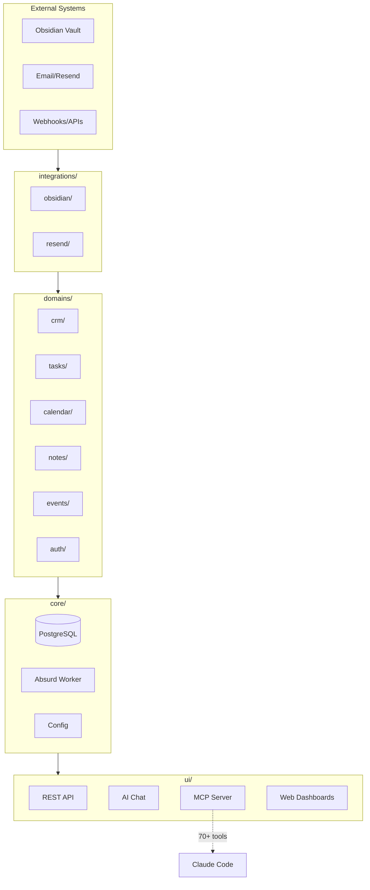
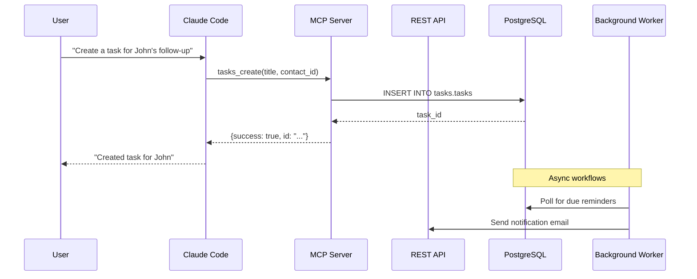
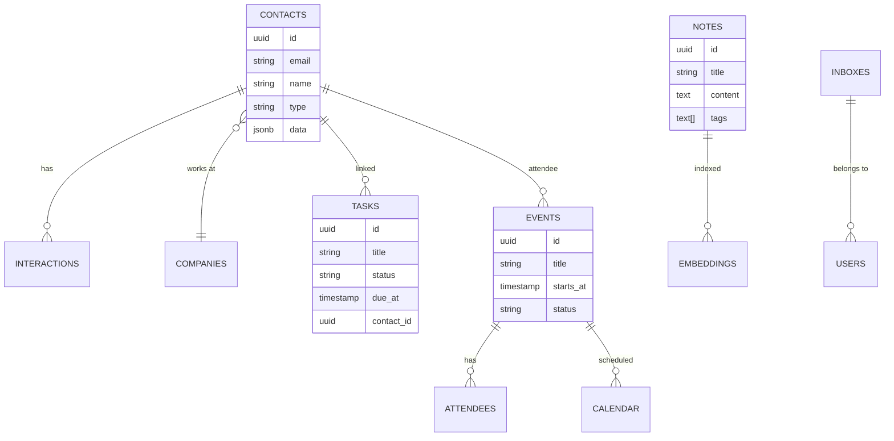

<picture>
  <source media="(prefers-color-scheme: dark)" srcset="https://raw.githubusercontent.com/codimusmaximus/substrate/main/docs/assets/logo-dark.svg">
  <source media="(prefers-color-scheme: light)" srcset="https://raw.githubusercontent.com/codimusmaximus/substrate/main/docs/assets/logo-light.svg">
  
</picture>

# Substrate

**Your personal business operating system.** Build integrated business systems with PostgreSQL, Python, and AI-native interfaces.

[](https://opensource.org/licenses/MIT)
[](https://www.python.org/downloads/)
[](https://modelcontextprotocol.io/)

---

## The Problem

You're running a business with 10+ SaaS subscriptions. Your data is scattered. Nothing integrates well. You can't query across systems. You don't own anything.

## The Solution

**Substrate** gives you the primitives to build exactly what you need:

```
┌─────────────────────────────────────────────────────────────────┐
│                         YOUR BUSINESS                            │
├─────────────────────────────────────────────────────────────────┤
│  📇 CRM        📋 Tasks       📅 Calendar      📝 Notes          │
│  💼 Sales      📧 Email       🔔 Events        🔐 Auth           │
├─────────────────────────────────────────────────────────────────┤
│                     🤖 AI Chat Interface                         │
│                     🔌 70+ MCP Tools                             │
│                     🔄 Background Workflows                      │
├─────────────────────────────────────────────────────────────────┤
│                     🐘 PostgreSQL (You Own It)                   │
└─────────────────────────────────────────────────────────────────┘
```

---

## Architecture



---

## Data Flow



---

## Quick Start

```bash
# Clone
git clone https://github.com/codimusmaximus/substrate.git
cd substrate

# Configure
cp .env.template .env
# Add your OPENAI_API_KEY to .env

# Launch
uv sync && make init
```

**That's it.** Open http://localhost:8000

| Endpoint | Purpose |
|----------|---------|
| [localhost:8000](http://localhost:8000) | Dashboard |
| [localhost:8000/chat](http://localhost:8000/chat) | AI Chat |
| [localhost:8000/crud](http://localhost:8000/crud) | Data Browser |
| [localhost:7890](http://localhost:7890) | Task Monitor |

---

## Domain Model



---

## Claude Code Integration

Substrate exposes **70+ MCP tools** to Claude Code:

```bash
# Add Substrate as MCP server
claude mcp add substrate -- .venv/bin/python -m substrate.ui.mcp.server
```

Then ask Claude:

```
"Show me contacts I haven't talked to in 30 days"
"Create a meeting with John for tomorrow at 2pm"
"Draft a follow-up email for the Acme deal"
"What tasks are due this week?"
```

### Available Tools

| Domain | Tools |
|--------|-------|
| **CRM** | `crm_contacts_query`, `crm_contacts_create`, `crm_companies_*`, `crm_interactions_*` |
| **Tasks** | `tasks_pending`, `tasks_create`, `tasks_complete`, `tasks_query` |
| **Calendar** | `calendar_today`, `calendar_upcoming`, `calendar_events_create`, `calendar_attendees_*` |
| **Notes** | `notes_query`, `notes_create`, `notes_update`, `notes_delete` |
| **Email** | `email_send`, `email_list`, `email_reply`, `email_stats` |
| **Events** | `events_rules_*`, `events_query`, `events_reprocess` |

---

## Tech Stack

| Layer | Technology | Purpose |
|-------|------------|---------|
| **Database** | PostgreSQL + pgvector | Data + embeddings |
| **Workflows** | [Absurd](https://github.com/absurd-industries/absurd) | Durable background tasks |
| **API** | FastAPI | REST endpoints |
| **AI** | Pydantic AI + OpenAI | Chat interface |
| **MCP** | Model Context Protocol | Claude Code integration |
| **Monitoring** | Habitat (Go + SolidJS) | Task dashboard |

---

## Project Structure

```
substrate/
├── core/                   # Infrastructure
│   ├── db/                 # Connection pool, migrations
│   ├── worker/             # Background task runner
│   └── config.py           # Environment configuration
│
├── domains/                # Business Logic
│   ├── auth/               # Users, inboxes
│   ├── calendar/           # Events, attendees, reminders
│   ├── crm/                # Contacts, companies, interactions
│   ├── email/              # Send/receive via Resend
│   ├── events/             # Routing rules, pattern matching
│   ├── notes/              # Knowledge base, embeddings
│   └── tasks/              # Task management
│
├── integrations/           # External Systems
│   ├── obsidian/           # Vault sync (optional)
│   └── resend/             # Email API
│
├── ui/                     # Interfaces
│   ├── api/                # FastAPI REST server
│   ├── chat/               # AI chat agent
│   ├── mcp/                # Claude Code MCP server
│   └── web/                # HTML dashboards
│
├── habitat/                # Task monitoring (Go)
└── libs/absurd-sdk/        # Vendored workflow SDK
```

---

## Adding a Domain

Create your own domain in minutes:

```bash
mkdir -p substrate/domains/invoicing/sql
```

**1. Schema** (`sql/001_init.sql`):
```sql
CREATE SCHEMA IF NOT EXISTS invoicing;

CREATE TABLE invoicing.invoices (
    id UUID PRIMARY KEY DEFAULT gen_random_uuid(),
    contact_id UUID REFERENCES crm.contacts(id),
    status TEXT DEFAULT 'draft',
    total_cents INTEGER,
    due_at TIMESTAMPTZ,
    created_at TIMESTAMPTZ DEFAULT now()
);
```

**2. Logic** (`logic.py`):
```python
from substrate.core.db.connection import get_connection

def create_invoice(contact_id: str, items: list) -> dict:
    with get_connection() as conn:
        # Your business logic here
        pass
```

**3. AI Tools** (`tools.py`):
```python
def create_invoice_tool(contact_id: str, items: list) -> dict:
    """Create an invoice for a contact."""
    return create_invoice(contact_id, items)
```

**4. Run migrations:**
```bash
make migrate
```

Your domain is now queryable via API and available to Claude Code.

---

## Configuration

| Variable | Required | Description |
|----------|----------|-------------|
| `DATABASE_URL` | Yes | PostgreSQL connection |
| `OPENAI_API_KEY` | For AI | Chat and embeddings |
| `RESEND_API_KEY` | For email | Send emails |
| `VAULT_REPO` | For sync | Obsidian git sync |

See [.env.template](.env.template) for all options.

---

## Development

```bash
make help          # Show all commands
make api           # Run API with hot reload
make worker        # Run background worker
make db            # PostgreSQL shell
make migrate       # Run migrations
```

---

## Philosophy

> **Manual first.** Do it by hand until you understand it.
>
> **Then systematize.** Create tables and workflows when the pattern is clear.
>
> **Then augment.** Add AI tools when intelligence would help.
>
> **Then automate.** Schedule agents when you trust the process.

See [docs/ARCHITECTURE.md](docs/ARCHITECTURE.md) for the full design philosophy.

---

## Contributing

We welcome contributions! See [CONTRIBUTING.md](CONTRIBUTING.md) for guidelines.

---

## License

MIT License - see [LICENSE](LICENSE) for details.

---

<p align="center">
  <sub>Built for solopreneurs who want to own their stack.</sub>
</p>
